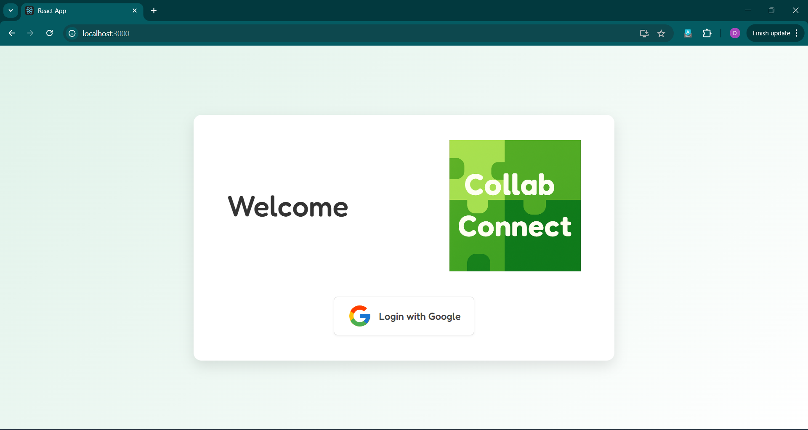
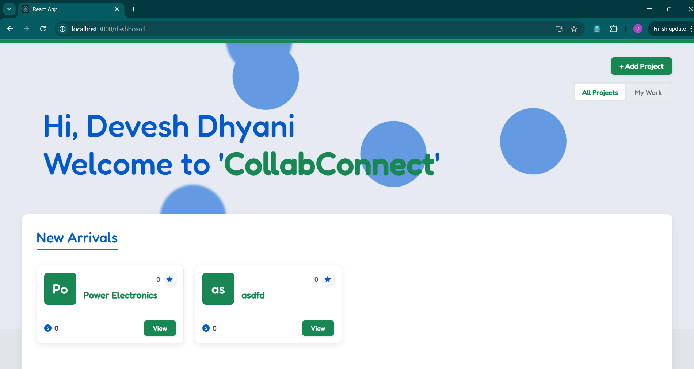
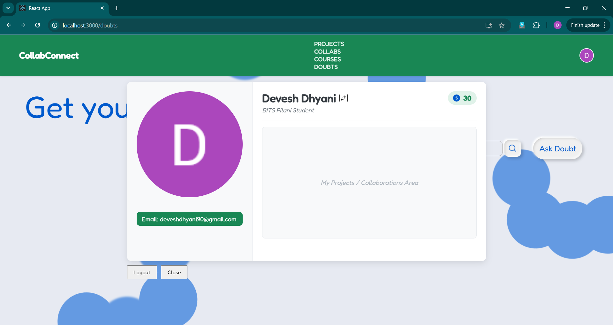
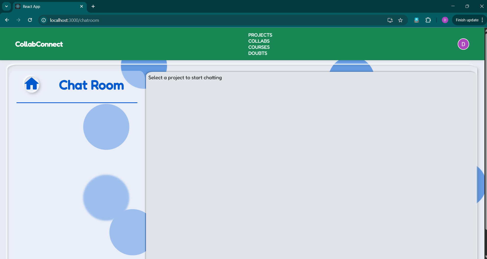
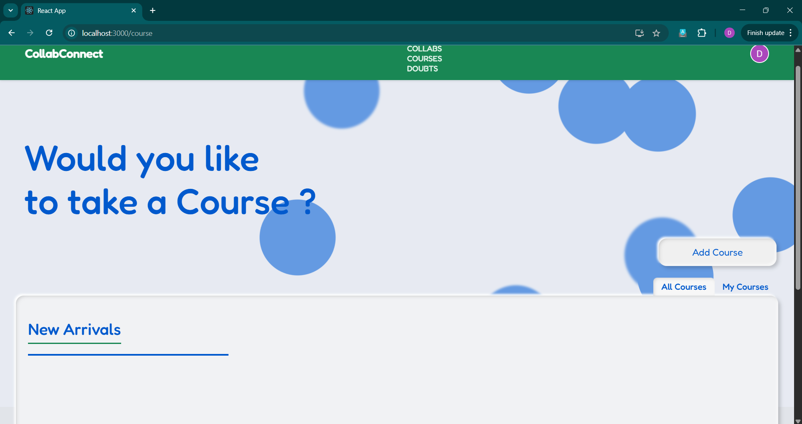
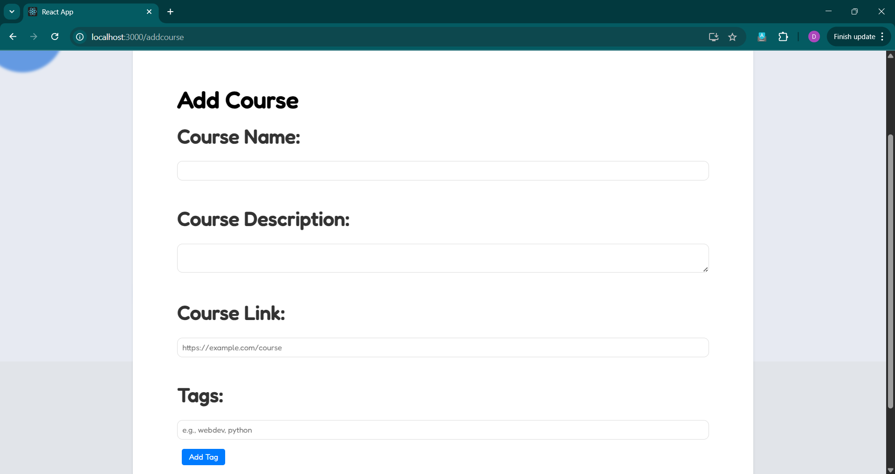
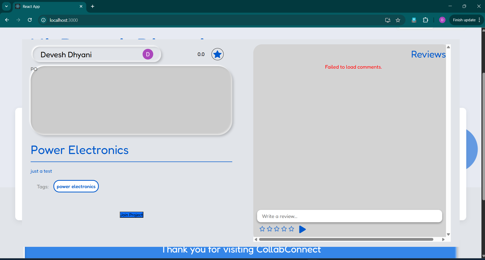
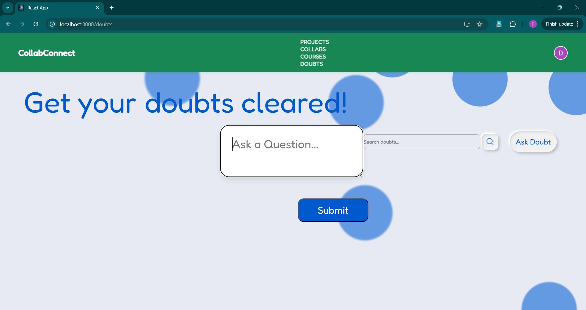

# CollabConnect: A MERN Stack Project with Firebase Auth

## Description
CollabConnect is a web application aimed at enhancing the educational experience by providing a platform for students to collaborate, showcase their projects, and connect with peers. Built using the MERN stack and Firebase Authentication, it facilitates sharing knowledge, receiving feedback, and exploring new opportunities within the BITS Pilani community (or adaptable for other institutions).

## Tech Stack Used
- **MongoDB:** NoSQL database using Mongoose ODM for storing user data, projects, courses, doubts, etc.
- **Express.js:** Backend web application framework running on Node.js.
- **React:** Frontend library for building the user interface.
- **Node.js:** JavaScript runtime environment for executing server-side JavaScript code.
- **Firebase Authentication:** Handles user authentication via Google Sign-In.
- **Firebase Admin SDK:** Used on the backend to verify user tokens.
- **Axios:** Used on the frontend for making HTTP requests to the backend API.
- **Socket.IO:** (Assumed based on code/previous discussion) For real-time chat functionality.
- **CSS:** Used for styling the application (potentially with some specific libraries if used).

## User Research
User research was conducted to understand the needs and challenges faced by students in collaborating and sharing their academic projects. Insights gathered from surveys and interviews helped in shaping the features and functionalities of CollabConnect.

## Features Implemented
- **Google Authentication:** Secure user login/signup using Google accounts via Firebase Authentication.
- **Project Showcase:** Users can create, view, and display project details (description, tags, owner, links). Includes pop-up modals for detailed views.
- **Course Listings:** Users can add and view courses relevant to their peers. Includes pop-up modals for detailed views.
- **Review & Rating System:** Users can review and rate both projects and courses. Average ratings are displayed.
- **Collaborator System:** Backend logic allows users to request to join projects and owners to manage collaborators (Note: Frontend UI for owner approval/rejection might need further development).
- **Project Completion & Credits:** Project owners can mark projects as complete, distributing predefined credits to approved collaborators.
- **Q&A (Doubts) Platform:** Users can post questions and answer others' doubts.
- **Voting System:** Answers on the Doubts page can be upvoted/downvoted, influencing user credit scores.
- **Credit System:** Users earn/lose credits based on answer votes and project completion.
- **Real-time Chat:** Project-specific chat rooms for collaborators (using Socket.IO).
- **User Profiles:** Displays basic user information, earned credits, skills (tags), and linked projects/courses. Profile update functionality included.

## Future Updates
Planned updates include:
- Implementation of wish-list including liked projects, courses, and profiles.
- Implementation of dynamic search feature for projects, courses, and profiles.
- AI based doubt solving.
- Enhanced collaborator approval/rejection workflow (UI integration).
- Integration with educational resources and APIs.
- Mobile app enhancements for better user engagement.
- Further UI/UX refinements and error handling improvements.

## Different Pages / Views
- **Login Page:** For Google Sign-In.
- **Dashboard (Home):** Displays "All Projects" and "My Work" (Owned Projects & Collaborations).
- **Course Page:** Displays "All Courses" and courses added by the user.
- **Add Project Page:** Form for creating new projects.
- **Add Course Page:** Form for adding new courses.
- **Project Details Popup:** Modal showing full project info, reviews, collaborators, join button.
- **Course Details Popup:** Modal showing full course info and reviews.
- **Chat Room Page:** Displays project list and real-time chat interface for selected project.
- **Doubts Page:** Q&A forum with voting.
- **Update Profile Page:** Form for editing user profile details (GitHub link, designation, tags).
- **Profile Card Popup:** Modal displaying user profile details.

## User Interface
The user interface is designed to be intuitive and user-friendly, emphasizing ease of navigation and accessibility. It currently features a green and white theme and includes responsive design considerations for compatibility with various devices and screen sizes.

## Installation and Setup

1.  **Prerequisites:**
    *   Node.js and npm (or yarn) installed.
    *   MongoDB server running (locally or cloud instance like MongoDB Atlas).
    *   A Google Firebase project created ([https://console.firebase.google.com/](https://console.firebase.google.com/)).

2.  **Firebase Setup:**
    *   **Enable Google Sign-In:** In your Firebase project console, go to Authentication -> Sign-in method -> Enable Google provider and select a support email.
    *   **Backend Service Account Key:**
        *   Go to Project settings -> Service accounts.
        *   Generate a new private key (JSON file). **Keep this file secure!** Do not commit it to Git.
    *   **Frontend Web Configuration:**
        *   Go to Project settings -> General -> Your apps -> Web app.
        *   If you don't have a web app, create one.
        *   Copy the `firebaseConfig` object (containing `apiKey`, `authDomain`, etc.).

3.  **Backend Setup:**
    *   Navigate to the `backend` directory.
    *   Create a `.env` file in the `backend` root directory.
    *   Add the following environment variables to the `.env` file:
        ```dotenv
        MONGO_URI=mongodb://127.0.0.1:27017/collabconnect # Replace with your MongoDB connection string
        PORT=3001 # Or any other port for the backend
        GOOGLE_APPLICATION_CREDENTIALS=/path/to/your/serviceAccountKey.json # IMPORTANT: Replace with the full path to the downloaded service account key file
        ```
    *   Install dependencies:
        ```sh
        cd backend
        npm install
        ```
    *   Start the server (using nodemon if configured):
        ```sh
        npm run dev
        # OR
        npm start
        ```
    *   The backend should be running on `http://localhost:3001` (or your specified `PORT`).

4.  **Frontend Setup:**
    *   Navigate to the `frontend` directory.
    *   Create a file named `src/firebaseConfig.js`.
    *   Paste the following structure into it, replacing the placeholder values with your **Firebase Web Configuration** copied from the Firebase console:
        ```javascript
        // src/firebaseConfig.js
        import { initializeApp } from "firebase/app";
        import { getAuth, GoogleAuthProvider } from "firebase/auth";

        const firebaseConfig = {
          apiKey: "YOUR_API_KEY",
          authDomain: "YOUR_AUTH_DOMAIN",
          projectId: "YOUR_PROJECT_ID",
          storageBucket: "YOUR_STORAGE_BUCKET",
          messagingSenderId: "YOUR_MESSAGING_SENDER_ID",
          appId: "YOUR_APP_ID"
        };

        const app = initializeApp(firebaseConfig);
        const auth = getAuth(app);
        const googleProvider = new GoogleAuthProvider();

        export { auth, googleProvider };
        ```
    *   Install dependencies (if you haven't already run the Firebase/Axios install commands):
        ```sh
        cd frontend
        npm install
        ```
    *   Start the React app:
        ```sh
        npm start
        ```
    *   The application should open in your browser at `http://localhost:3000`.

## Web Application Snippets

**NOTE:** The screenshots below may be outdated due to recent changes (Firebase Auth, UI theme). Please generate new screenshots reflecting the current state of the application.

1.  **Google Authentication (Firebase)**<br>
    <br>

2.  **Dashboard displaying all projects / user's projects**<br>
  <br>

3.  **profile page**<br>
<br>

4.  **Collaborated projects community with real-time chat**<br>
    <br>

5.  **Course Display Page**<br>
    <br>
    <br>

5.  **Detailed project pop-out**<br>
    <br>

7.  **Q&A (Doubts) Page with voting**<br>
    <br>
